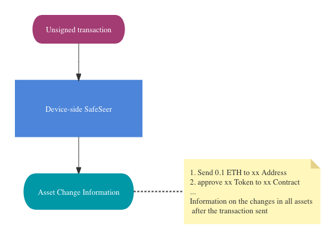

# SafeSeer

A tool that let you know the changes in each asset before send transaction (evm-compatible chain)

-- -

Why Rust?
run on the device, Wasm for Web, Static library for windows,Android,macOS,linux and iOS

-- -

